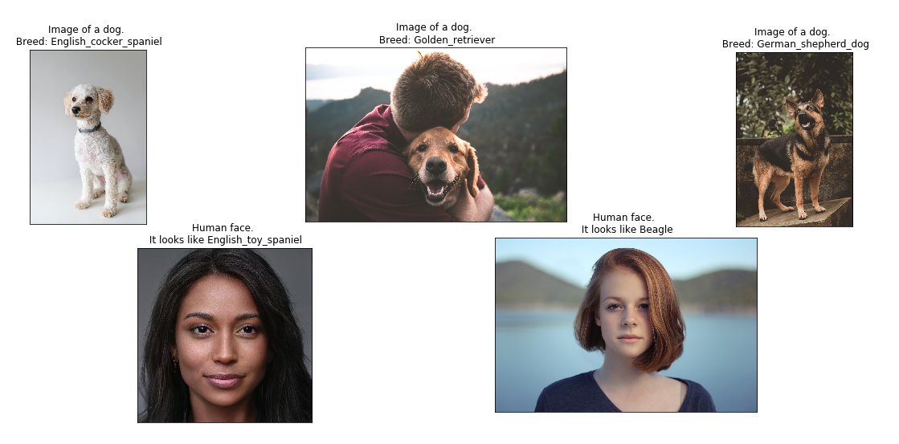
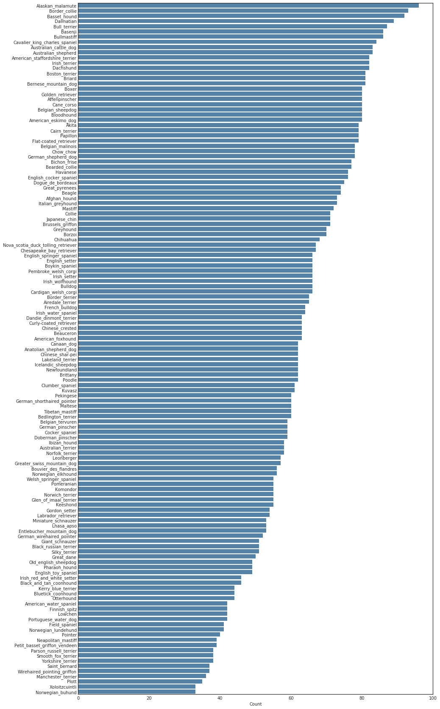
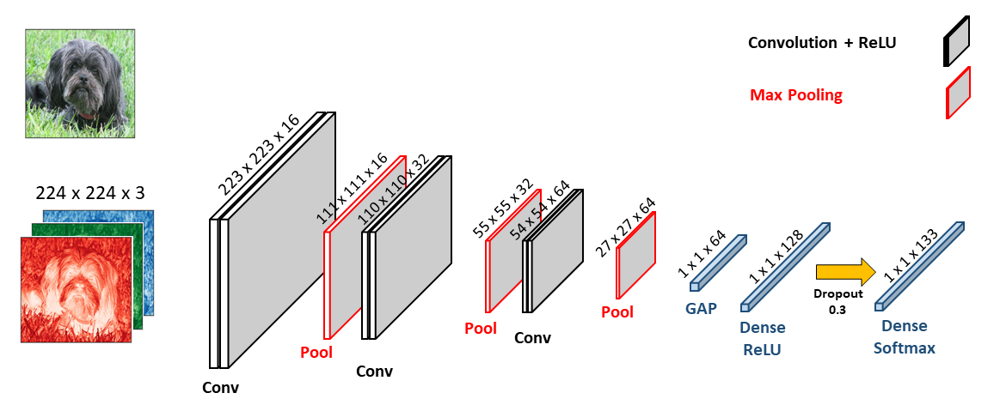

# Image Classification using CNNs

## Project Overview

<br> In this project, we build a pipeline that can be used within a web or mobile app to process real-world, user-supplied images.  Given an image of a dog, your algorithm will identify an estimate of the canine’s breed.  If supplied an image of a human, the code will identify the resembling dog breed.



<br> We explore Convolutional Neural Network (CNN) models for classification, and design a network to improve user experiences. This involves piecing together a series of models designed to perform various tasks in a data processing pipeline.

## The Data

<br> The data used in this project consists of 8,351 dog images in total. These images are labelled with 133 different dog categories. The [dog dataset](https://s3-us-west-1.amazonaws.com/udacity-aind/dog-project/dogImages.zip) is used for training, validation, and testing of the CNN models. Download the [dog dataset](https://s3-us-west-1.amazonaws.com/udacity-aind/dog-project/dogImages.zip).  Unzip the folder and place it in the repo, at location `path/to/dog-project/dogImages`.

<br> The [human dataset](https://s3-us-west-1.amazonaws.com/udacity-aind/dog-project/lfw.zip) includes 13,233 images of human faces. This dataset is not used for training a CNN; instead, we implement part of it to evaluate the performance of the human face detector algorithm in this project. Download the [human dataset](https://s3-us-west-1.amazonaws.com/udacity-aind/dog-project/lfw.zip).  Unzip the folder and place it in the repo, at location `path/to/dog-project/lfw`.

<br> The following bar chart shows the distribution of dog images across the classes in the dog dataset:



## Analysis

<br> The analysis and methodology of this project involve four main sections:

### 1- Detecting human face in an image
<br> To detect a human face in an image, we use OpenCV’s implementation of [Haar feature-based cascade classifiers](http://docs.opencv.org/trunk/d7/d8b/tutorial_py_face_detection.html). In the application, the image is converted to gray scale, detects the human faces, and displays the bounding boxes around the detected faces.

### 2- Detecting dogs in an image
<br> To detect dogs in the image, we use a pre-trained [ResNet-50](http://ethereon.github.io/netscope/#/gist/db945b393d40bfa26006) model, which returns a prediction for the object. This model has been trained on the popular [ImageNet](http://www.image-net.org/) dataset used for image classification and other vision tasks.

### 3- Creating a CNN to classify dog breeds - From Scratch
<br> After pre-processing the images, we use them as the input to the CNN model. The following figure shows the structure of the CNN model for for dog breed classification:



### 4- Creating a CNN to Classify dog breeds - Transfer Learning
<br> In this part we use transfer learning to create a CNN that can identify dog breed from images. We present the results using the bottleneck features from [ResNet-50](https://s3-us-west-1.amazonaws.com/udacity-aind/dog-project/DogResnet50Data.npz) pre-trained model.
<br> Download the [ResNet-50](https://s3-us-west-1.amazonaws.com/udacity-aind/dog-project/DogResnet50Data.npz) bottleneck features, and store the downloaded file in the <i>bottleneck_features/</i> folder.
<br> The CNN model used for dog breed classification with transfer learning includes: 1) global average pooling layer, 2) dense layer with ReLU activation function, 3) dropout layer (0.2), and 4) dense layer with Softmax. The test accuracy for this CNN model is 81.2%.

## Instructions
1. The data:
    - Download the [dog dataset](https://s3-us-west-1.amazonaws.com/udacity-aind/dog-project/dogImages.zip).  Unzip the folder and place it in the repo, at location `path/to/dog-project/dogImages`.
	- Download the [human dataset](https://s3-us-west-1.amazonaws.com/udacity-aind/dog-project/lfw.zip).  Unzip the folder and place it in the repo, at location `path/to/dog-project/lfw`.

2. Bottleneck features:
    - Download the [VGG-16 bottleneck features](https://s3-us-west-1.amazonaws.com/udacity-aind/dog-project/DogVGG16Data.npz) for the dog dataset.  Place it in the repo, at location `path/to/dog-project/bottleneck_features`.
	- Download the [VGG-19 bottleneck features](https://s3-us-west-1.amazonaws.com/udacity-aind/dog-project/DogVGG19Data.npz) for the dog dataset.  Place it in the repo, at location `path/to/dog-project/bottleneck_features`.
	- Download the [Resnet50 bottleneck features](https://s3-us-west-1.amazonaws.com/udacity-aind/dog-project/DogResnet50Data.npz) for the dog dataset.  Place it in the repo, at location `path/to/dog-project/bottleneck_features`.


3. (Optional) __If you plan to install TensorFlow with GPU support on your local machine__, follow [the guide](https://www.tensorflow.org/install/) to install the necessary NVIDIA software on your system.  If you are using an EC2 GPU instance, you can skip this step.

4. (Optional) **If you are running the project on your local machine (and not using AWS)**, create (and activate) a new environment.

	- __Linux__ (to install with __GPU support__, change `requirements/dog-linux.yml` to `requirements/dog-linux-gpu.yml`): 
	```
	conda env create -f requirements/dog-linux.yml
	source activate dog-project
	```  
	- __Mac__ (to install with __GPU support__, change `requirements/dog-mac.yml` to `requirements/dog-mac-gpu.yml`): 
	```
	conda env create -f requirements/dog-mac.yml
	source activate dog-project
	```  
	**NOTE:** Some Mac users may need to install a different version of OpenCV
	```
	conda install --channel https://conda.anaconda.org/menpo opencv3
	```
	- __Windows__ (to install with __GPU support__, change `requirements/dog-windows.yml` to `requirements/dog-windows-gpu.yml`):  
	```
	conda env create -f requirements/dog-windows.yml
	activate dog-project
	```

5. (Optional) **If you are running the project on your local machine (and not using AWS)** and Step 6 throws errors, try this __alternative__ step to create your environment.

	- __Linux__ or __Mac__ (to install with __GPU support__, change `requirements/requirements.txt` to `requirements/requirements-gpu.txt`): 
	```
	conda create --name dog-project python=3.5
	source activate dog-project
	pip install -r requirements/requirements.txt
	```
	**NOTE:** Some Mac users may need to install a different version of OpenCV
	```
	conda install --channel https://conda.anaconda.org/menpo opencv3
	```
	- __Windows__ (to install with __GPU support__, change `requirements/requirements.txt` to `requirements/requirements-gpu.txt`):  
	```
	conda create --name dog-project python=3.5
	activate dog-project
	pip install -r requirements/requirements.txt
	```
	
6. (Optional) **If you are using AWS**, install Tensorflow.
```
sudo python3 -m pip install -r requirements/requirements-gpu.txt
```
	
7. Switch [Keras backend](https://keras.io/backend/) to TensorFlow.
	- __Linux__ or __Mac__: 
		```
		KERAS_BACKEND=tensorflow python -c "from keras import backend"
		```
	- __Windows__: 
		```
		set KERAS_BACKEND=tensorflow
		python -c "from keras import backend"
		```

8. (Optional) **If you are running the project on your local machine (and not using AWS)**, create an [IPython kernel](http://ipython.readthedocs.io/en/stable/install/kernel_install.html) for the `dog-project` environment. 
```
python -m ipykernel install --user --name dog-project --display-name "dog-project"
```

9. (Optional) **If you are running the project on your local machine (and not using AWS)**, before running code, change the kernel to match the dog-project environment by using the drop-down menu (**Kernel > Change kernel > dog-project**). Then, follow the instructions in the notebook.

## Licensing, Acknowledgements
<br> This project has been performed as a part of [Udacity Data Scientist Nanodegree](https://www.udacity.com/course/data-scientist-nanodegree--nd025). The author wishes to acknowledge [Udacity](https://www.udacity.com/) for providing the data and templates.

## Author
<br>[Siavash Nejadi](https://github.com/snejadi/)